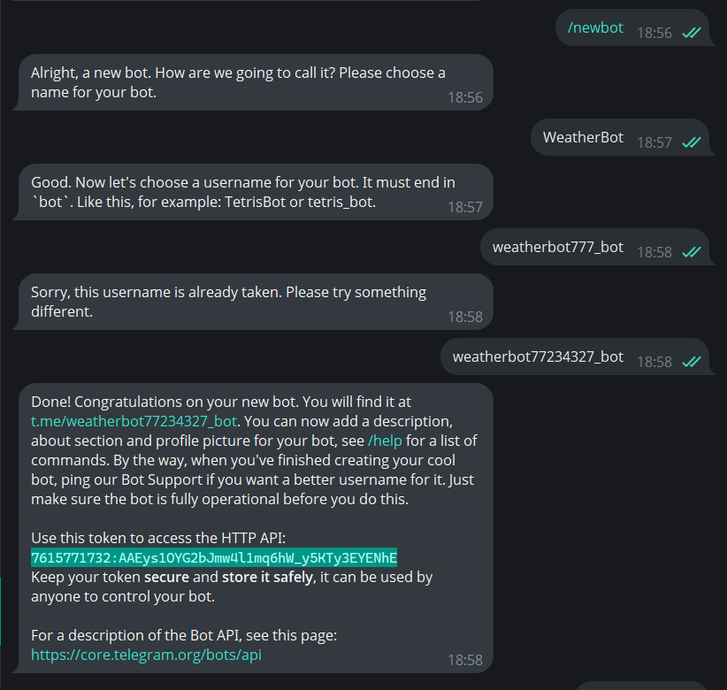
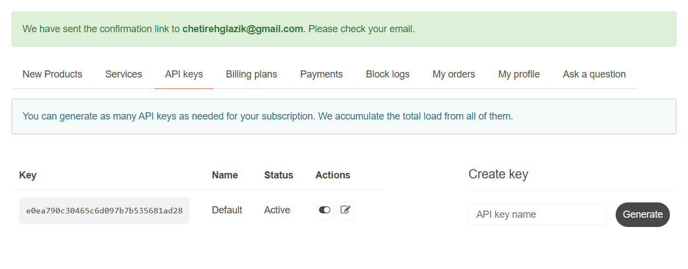
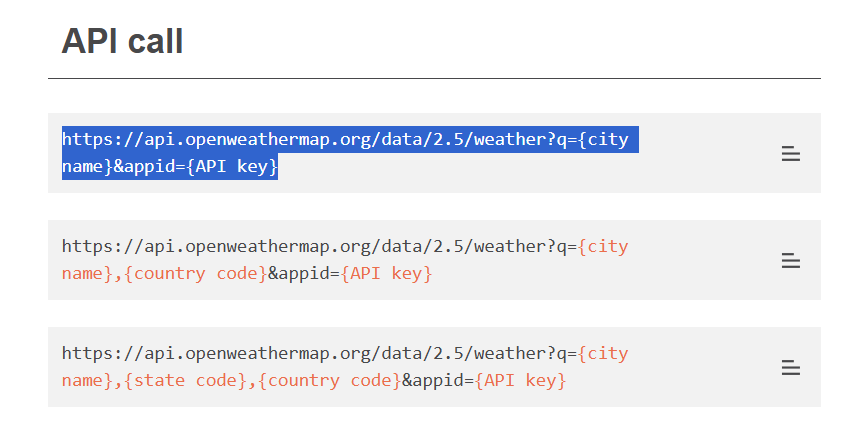

## Техническое руководство по созданию бота

### Шаг 1: Создание бота в Telegram

1. Откройте Telegram и введите в поисковой строке @BotFather
2. Используйте команду /newbot для создания нового бота
3. Запишите полученный токен (он понадобится позже): 


### Шаг 2: Получение API ключа OpenWeatherMap

1. Зарегистрируйтесь на [OpenWeatherMap](https://openweathermap.org/)
2. Перейдите в раздел API Keys (он находиться в личном кабинете), создайте новый API ключ и сохраните его:
 

3. Так же нам понадобится API-запрос для получения данных о погоде по названию города, он находится в разделе API - Built-in API request by city name (копируем первый из 3-х):
 


### Шаг 3: Переходим к написанию кода

1. Устанавливаем необходимые библиотеки через терминал:
   ```bash
   pip install pyTelegramBotAPI
Библиотека `pyTelegramBotAPI` необходима для работы с Telegram API

   ```bash
   pip install requests
Библиотека `requests` для HTTP-запросов к OpenWeatherMap 

Библиотека `requests` для HTTP-запросов к OpenWeatherMap 
2.
